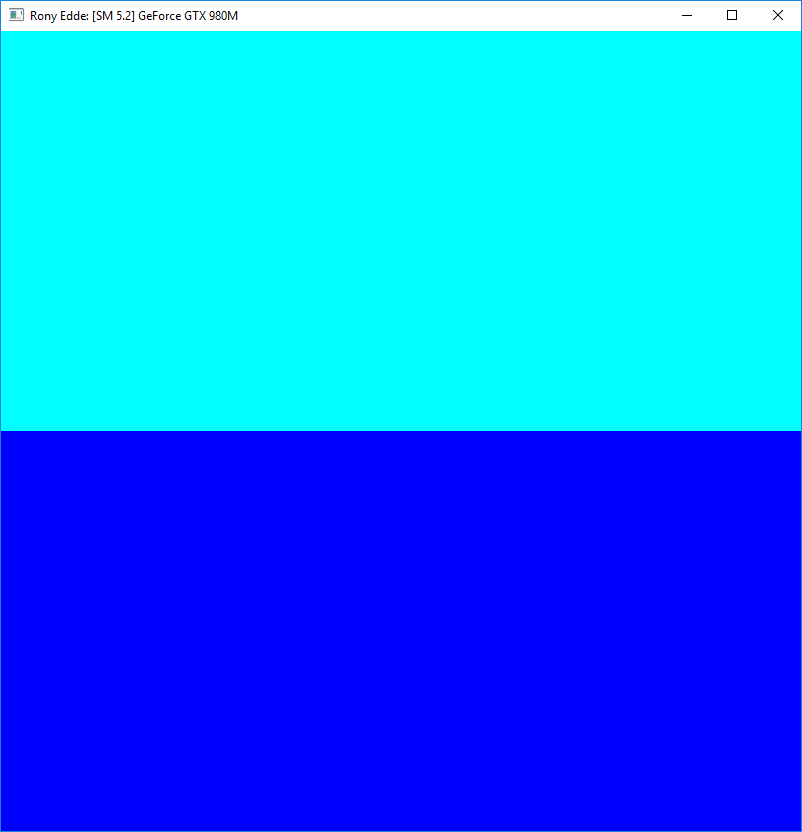
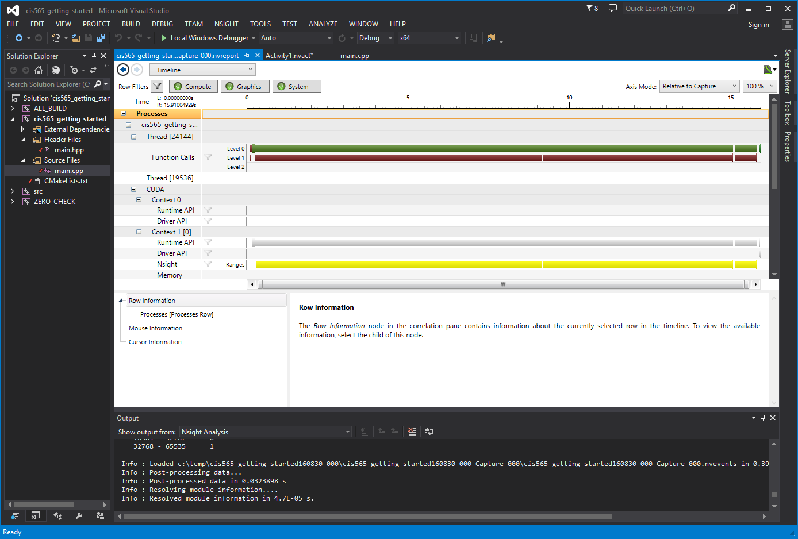

Project 0 CUDA Getting Started
====================

**University of Pennsylvania, CIS 565: GPU Programming and Architecture, Project 0**

* RONY EDDE
* Tested on: Personal Laptop Windows 22, i7-6700k @ 4.00GHz 64GB, GTX 980M 8192MB (home)

### (TODO: Your README)

Include screenshots, analysis, etc. (Remember, this is public, so don't put
anything here that you don't want to share with the world.)

**Title changes and performance analysis**

