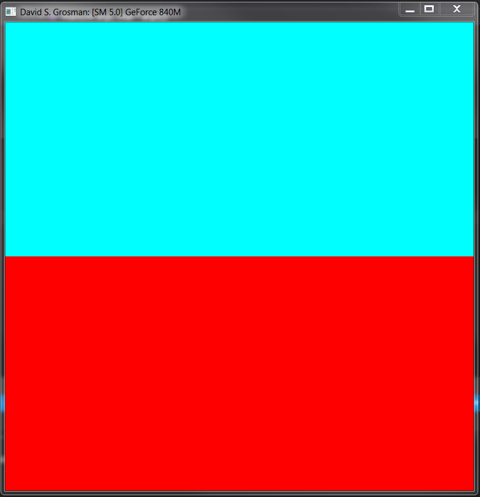
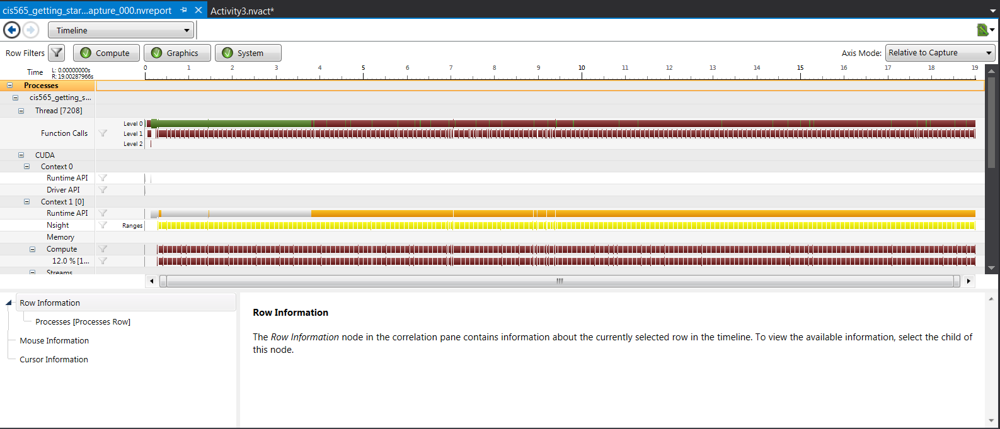

# University of Pennsylvania, CIS 565: GPU Programming and Architecture
Project 0 CUDA: Getting Started
====================

## User resources
- **Name:** David Grosman.
- **Tested on:** Microsoft Windows 7 Professional, i7-5600U @ 2.6GHz, 256GB, GeForce 840M (Personal laptop).

## Screenshots

**Part 4 - Output**: 

**Part 5 - NSight Timeline**: 

