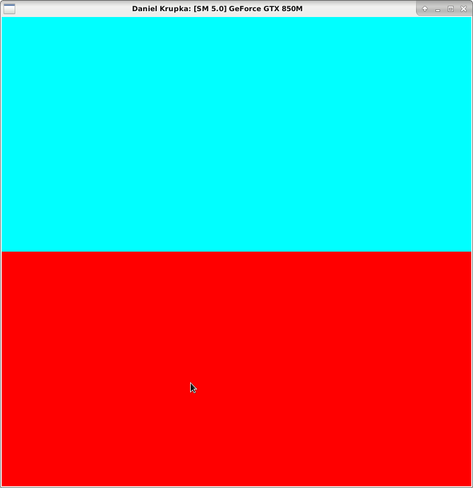
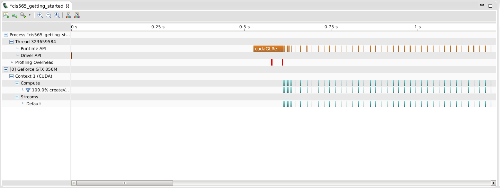

Project 0 CUDA Getting Started
====================

**University of Pennsylvania, CIS 565: GPU Programming and Architecture, Project 0**

* Daniel Krupka
* Tested on: Debian testing (stretch), Intel(R) Core(TM) i7-4710HQ CPU @ 2.50GHz 8GB, GTX 850M

