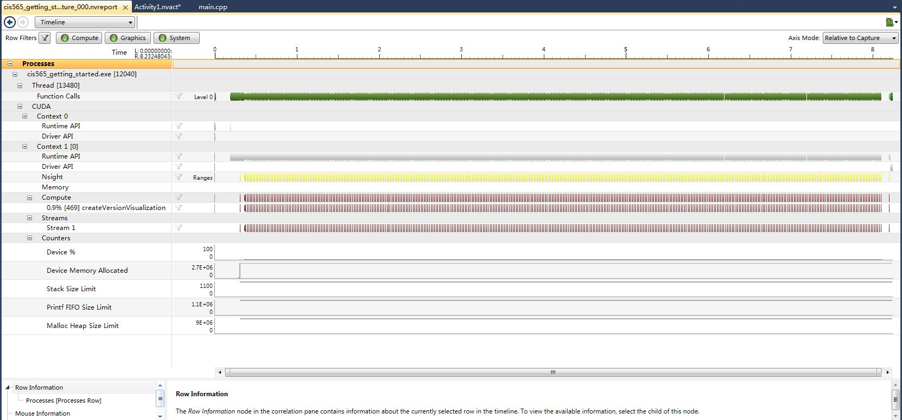

Project 0 CUDA Getting Started
====================

**University of Pennsylvania, CIS 565: GPU Programming and Architecture, Project 0**

* Xiang Deng
* Tested on: Windows 7, i7-3610QM @ 2.3GHz 8GB, GTX 660M 1024MB 

* Performance Analysis - Time-line

