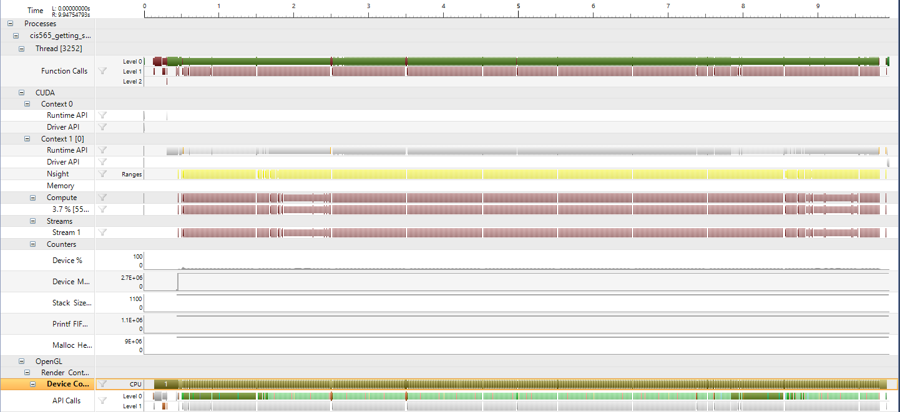
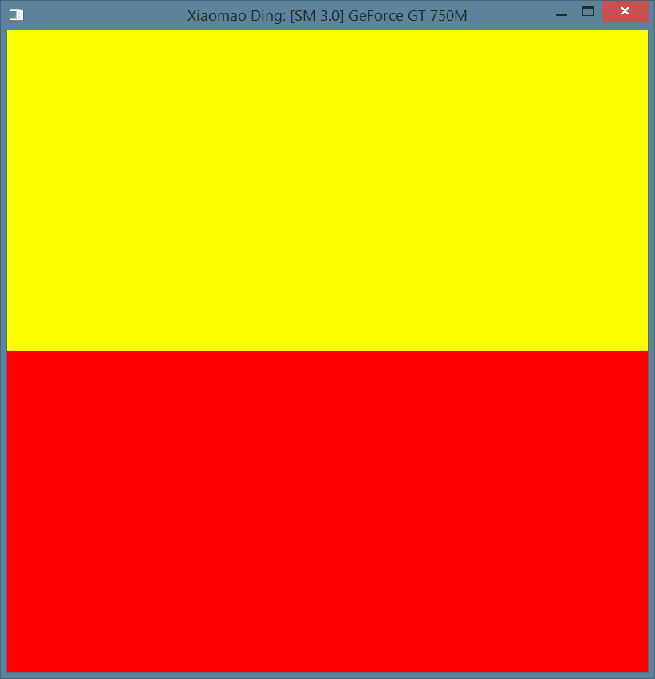

Project 0 CUDA Getting Started
====================

**University of Pennsylvania, CIS 565: GPU Programming and Architecture, Project 0**

* Xiaomao Ding
* Tested on: Windows 8.1, i7-4700MQ @ 2.40GHz 8.00GB, GT 750M 2047MB (Personal Computer)

Here is the performance anaylsis of my computer running the starter code for ~10 seconds. Hopefully, I will learn what these things mean!

I've added my name to the title bar! Woohoo!

