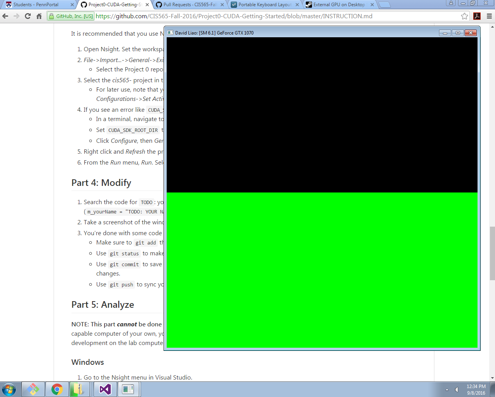
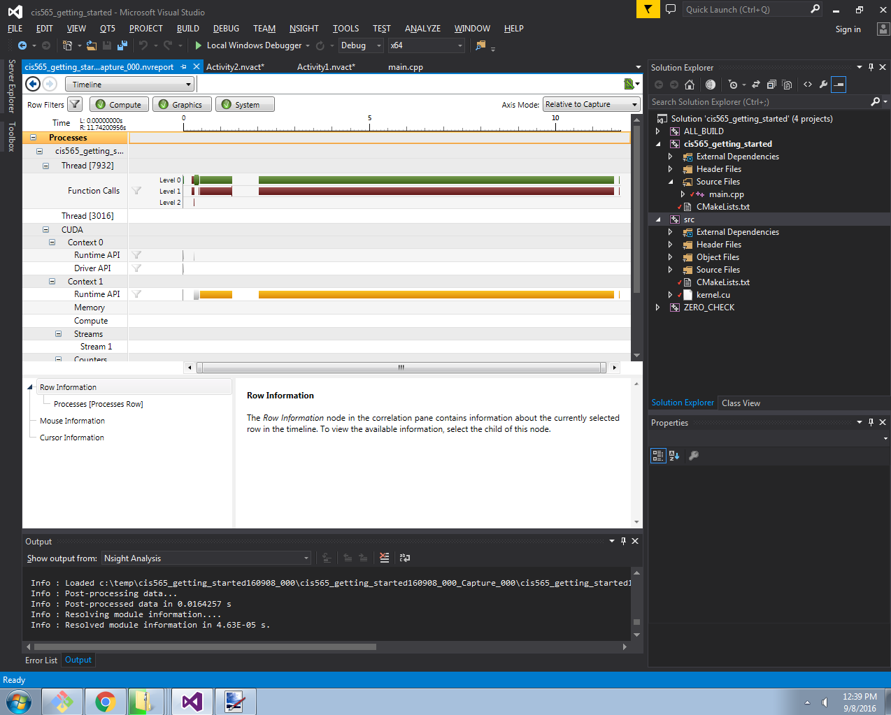

Project 0 CUDA Getting Started
====================

**University of Pennsylvania, CIS 565: GPU Programming and Architecture, Project 0**

* David Liao
* Tested on: Windows 7, Xeon E5-1630 v4 @ 3.70GHz 32GB, GTX 1070 4096MB (SigLab MOR 103-57)

 
