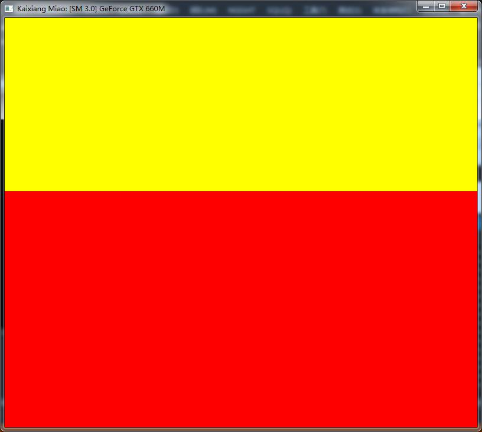
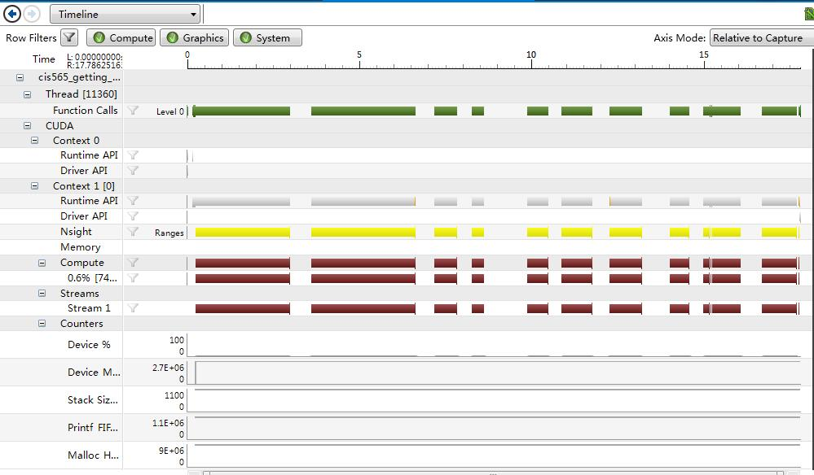

Project 0 CUDA Getting Started
====================

**University of Pennsylvania, CIS 565: GPU Programming and Architecture, Project 0**

* Kaixiang Miao
* Tested on: Windows 7, i7-3630QM @ 2.40GHz 8GB, GTX 660M 2GB (Lenovo Y580 laptop, personal computer)

### Screenshots

Output window:

Performance analysis:

