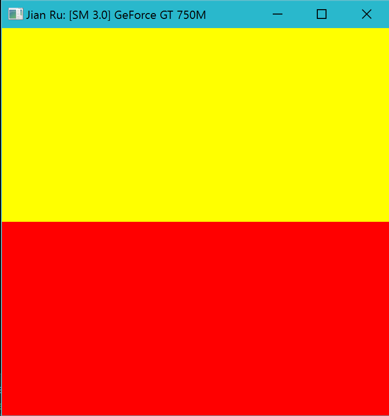
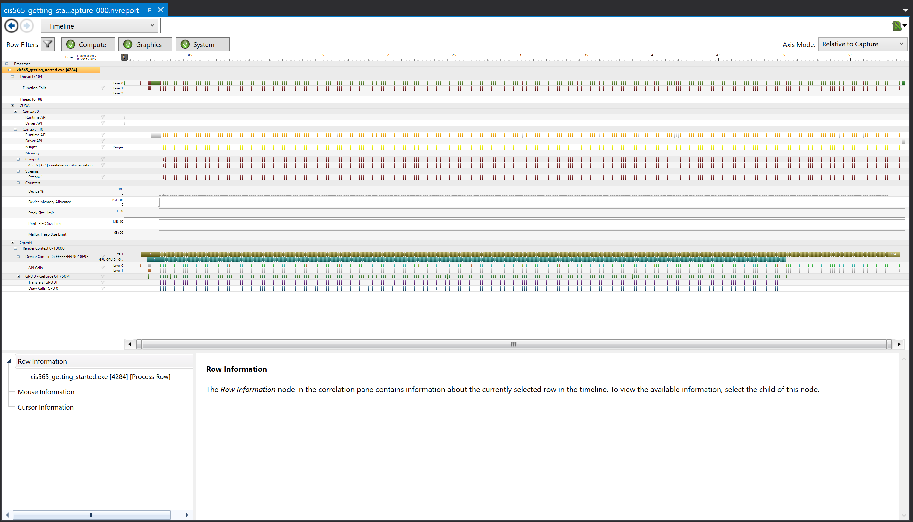

Project 0 CUDA Getting Started
====================

**University of Pennsylvania, CIS 565: GPU Programming and Architecture, Project 0**

* Jian Ru
* Tested on: Windows 10, i7-4850 @ 2.30GHz 16GB, GT 750M 2GB (Personal)

### Screen Shots

