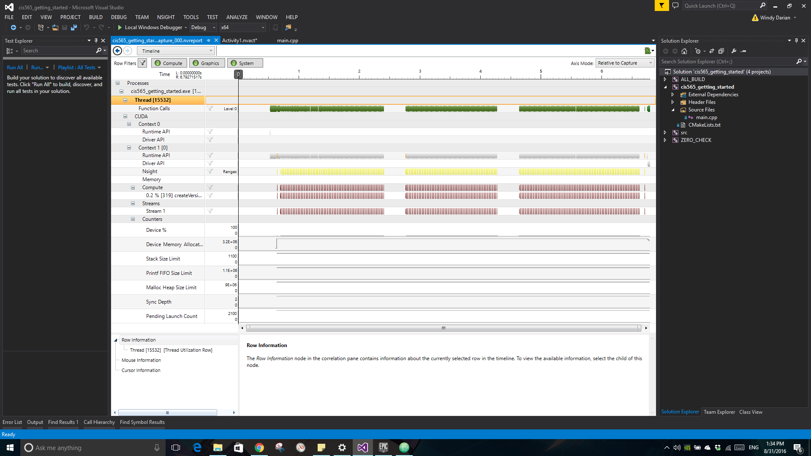

Project 0 CUDA Getting Started
====================

**University of Pennsylvania, CIS 565: GPU Programming and Architecture, Project 0**

* Ruoyu Fan
* Tested on: Windows 10, i7-4720HQ @ 2.60GHz, 16GB Memory,
             GTX 970M 3072MB
### Things I have done

* Name in title bar
* Screenshots
* Screenshot of analysis

My laptop comes with Nvidia Optimus. Whenever I hit "Launch" for the performance
analysis while "OpenGL" checked in "Trace Settings", the program crashes. So I
traced CUDA only in the screenshot.

