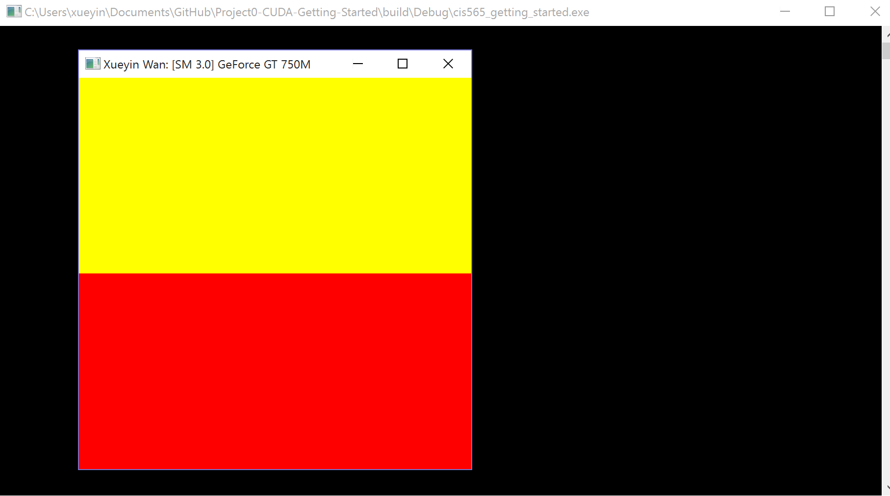
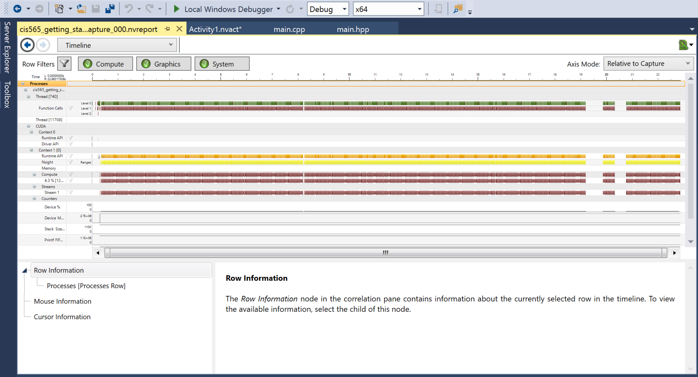

Project 0 CUDA Getting Started
====================

**University of Pennsylvania, CIS 565: GPU Programming and Architecture, Project 0**

* Xueyin Wan
* Tested on: Windows 10, i7-4870 @ 2.50GHz 16GB, NVIDIA GeForce GT 750M (Personal Laptop)

### (TODO: Your README)
Screenshot: 
Part 4: Modify
Name in title bar

Part 5: Analyze 
Timeline screenshot 

 

