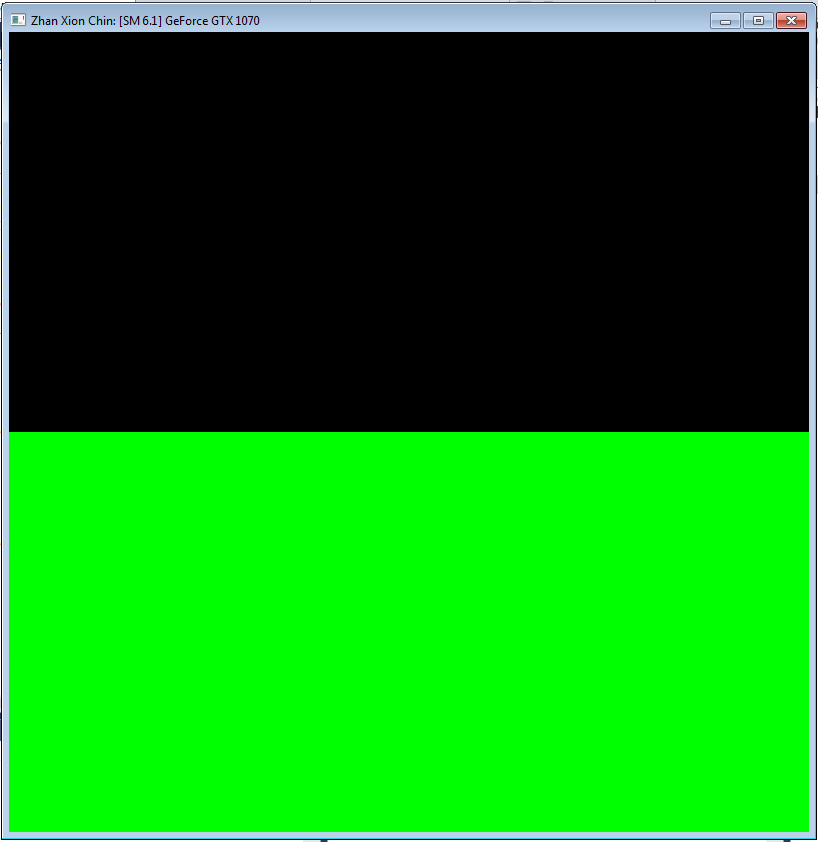
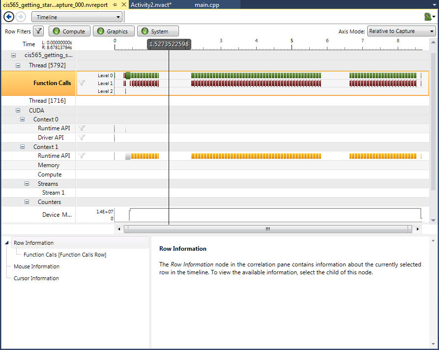

Project 0 CUDA Getting Started
====================

**University of Pennsylvania, CIS 565: GPU Programming and Architecture, Project 0**

* Zhan Xiong Chin
* Tested on: (TODO) Windows 7 Professional, Intel(R) Xeon(R) CPU E5-1630 v4 @ 3.70 GHz 3.70 GHz 32GB, GTX 1070 4096 MB (SIG Lab)

Screenshot of running program:

Screenshot of performance analysis (Timeline):

