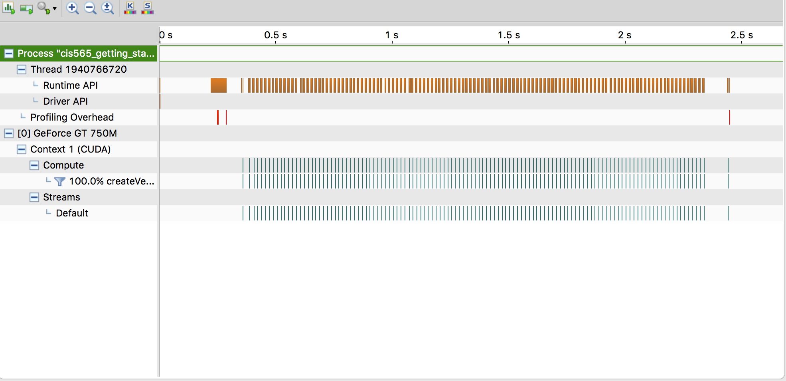

Project 0 CUDA Getting Started
====================

**University of Pennsylvania, CIS 565: GPU Programming and Architecture, Project 0**

* Zimeng Yang
* Tested on: OS X 10.11.6, i7-4850@ 2.3GHz 16G, GT 750M(Personal Laptop)

### Screenshots 
* Application window screenshot for **Part 4: Modify**

* Timeline screenshot for **Part 5: Analyze**

