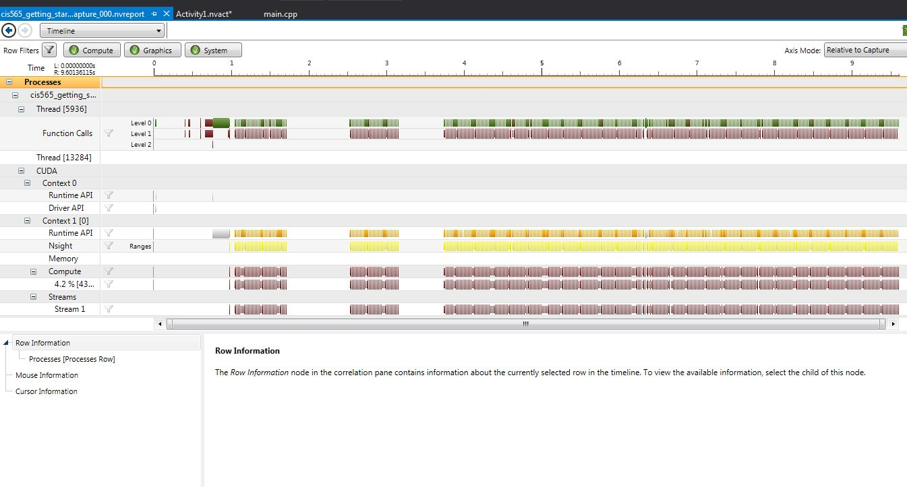

Project 0 CUDA Getting Started
====================

**University of Pennsylvania, CIS 565: GPU Programming and Architecture, Project 0**

* Richard Lee
* Tested on: Windows 7, i7-3720QM @ 2.60GHz 8GB, GT 650M 4GB (Personal Computer)

