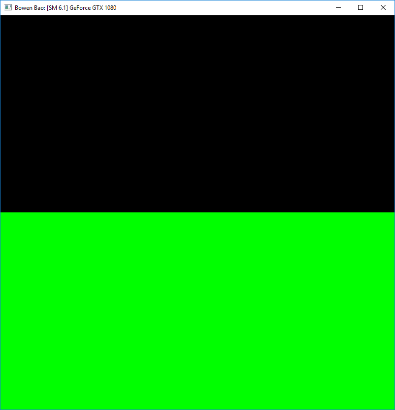
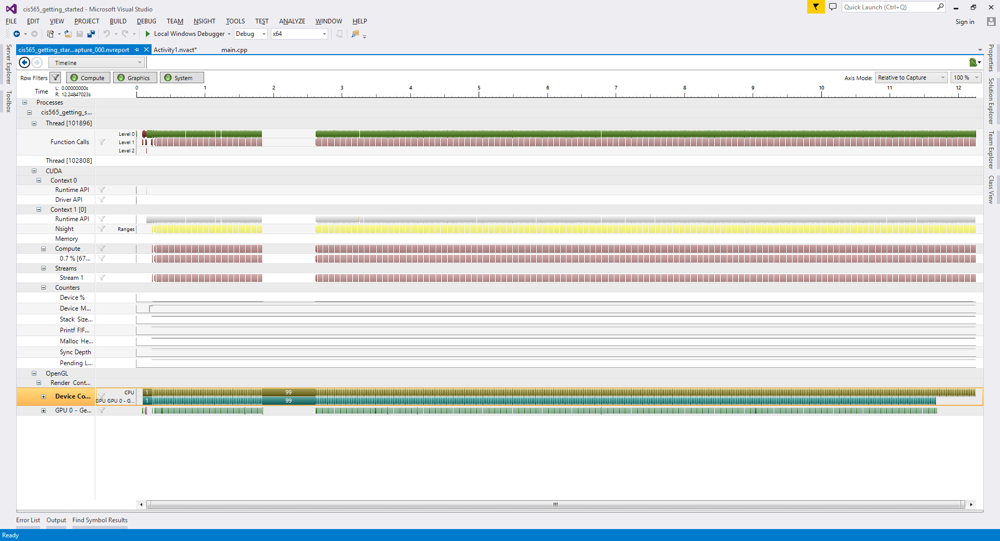

Project 0 CUDA Getting Started
====================

**University of Pennsylvania, CIS 565: GPU Programming and Architecture, Project 0**

* Bowen Bao
* Tested on: Windows 10, i7-6700K @ 4.00GHz 32GB, GTX 1080 8192MB (Personal)

### Screenshots
screenshot: 
analysis: 

