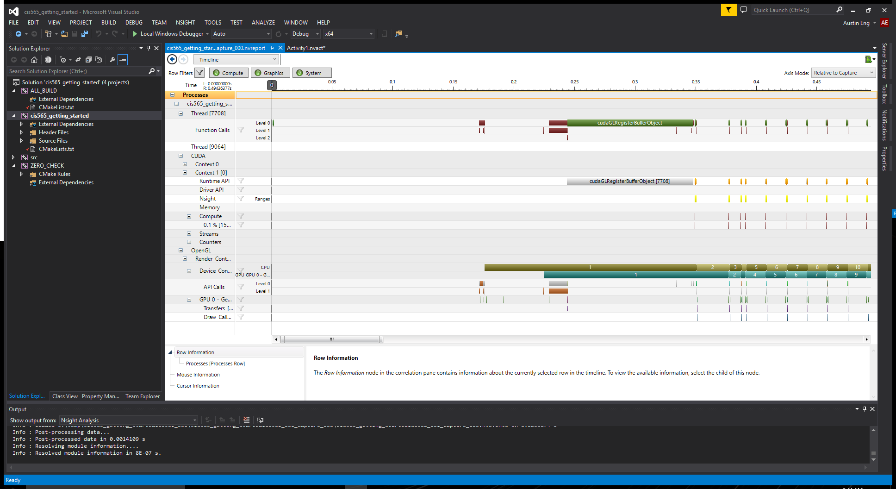

Project 0 CUDA Getting Started
====================

**University of Pennsylvania, CIS 565: GPU Programming and Architecture, Project 0**

* Austin Eng
* Tested on: Windows 10, i7-4770K @ 3.50GHz 16GB, GTX 780 3072MB (Personal Computer)

### Results

Part 4:

Part 5:

