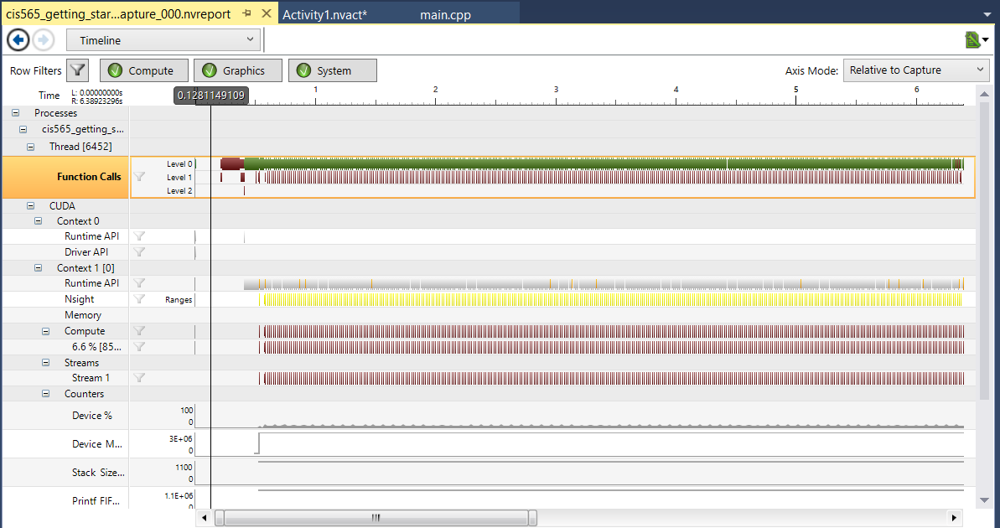

Project 0 CUDA Getting Started
====================

**University of Pennsylvania, CIS 565: GPU Programming and Architecture, Project 0**

* Liang Peng
* Tested on: Windows 10, i7-6700HQ @ 2.60GHz, 8GB, GTX 960M (Personal Computer)

### Results
* Part 4: Modify
 

* Part 5: Analyze
 
