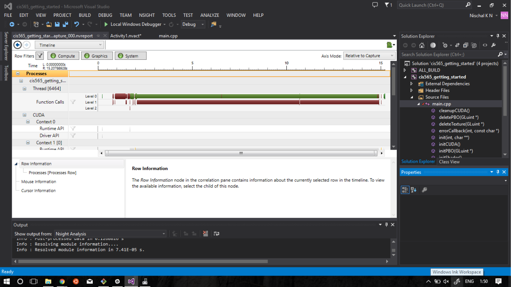

Project 0 CUDA Getting Started
====================

**University of Pennsylvania, CIS 565: GPU Programming and Architecture, Project 0**

* Nischal K N
* Tested on: Windows 10, i7-2670QM @ 2.20GHz 8GB, GTX 540 2GB (Personal)

### Screenshots

#### Part 4
Screenshot of execution of example CUDA program

#### Part 5
Screenshot of Timeline for performance analysis of CUDA and OpenGL

